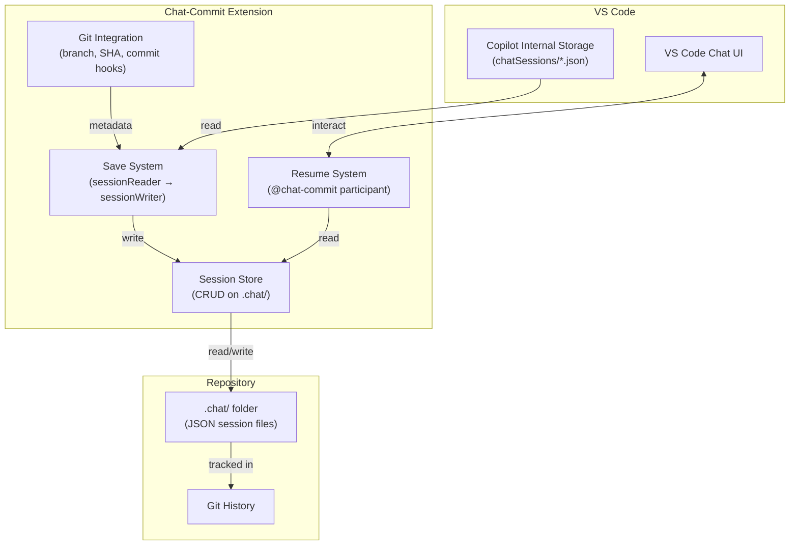

# Architecture

Chat-Commit is structured around two independent subsystems connected by a shared storage layer.

## System Diagram

## Subsystems

### Save System
Reads Copilot's internal session storage files, transforms them into the [Session Format](session-format.md), enriches with git metadata via [Git Integration](git-integration.md), and writes to `.chat/`. Applies bloat controls (size limits, splitting, stripping) before writing. See [Save System](save-system.md).

### Resume System
A registered VS Code chat participant (`@chat-commit`) that reads saved sessions from `.chat/`, applies context limits (max turns, max chars), and injects prior conversation as LLM context. See [Resume System](resume-system.md) and [Chat Participant](chat-participant.md).

### Session Store
CRUD layer for saved session files in `.chat/`. Handles file naming, searching, fuzzy matching, archival, and deletion. Used by both Save and Resume systems.

### Git Integration
Wraps the VS Code Git extension API. Provides branch name, commit SHA, dirty state. Optionally listens for commit events to trigger auto-save. See [Git Integration](git-integration.md).

## Data Flow

### Save Flow
1. User triggers "Save Current Chat Session" command
2. `sessionReader` accesses Copilot internal storage at `workspaceStorage/{workspaceId}/chatSessions/`
3. User selects which session to save via QuickPick
4. `sessionWriter` transforms to [Session Format](session-format.md), applies bloat controls
5. `sessionStore` writes JSON file to `.chat/` with git metadata from `gitIntegration`

### Resume Flow
1. User types `@chat-commit /resume fix-auth-bug` in chat
2. `chatParticipant` handler receives the request
3. `sessionStore` searches `.chat/` for matching session (fuzzy match)
4. Session JSON loaded, reassembled if split across parts
5. Context limits applied per [Configuration](configuration.md) (maxTurns, maxContextChars, overflowStrategy)
6. Prior turns injected as context; summary streamed to user

## Storage Format

Sessions are stored as JSON files in `.chat/`:  
`{timestamp}-{slugified-title}.json`  
e.g., `2026-04-12T14-30-fix-auth-bug.json`

Split sessions append `-part1`, `-part2`, etc. with linking metadata.

See [Session Format](session-format.md) for the full schema.

## Technology Constraints

- **VS Code `^1.93.0`** — Required for stable chat participant API
- **TypeScript** — Extension language
- **Webpack** — Bundling
- **VS Code Git Extension API** — For git metadata (not shelling out to git CLI)
