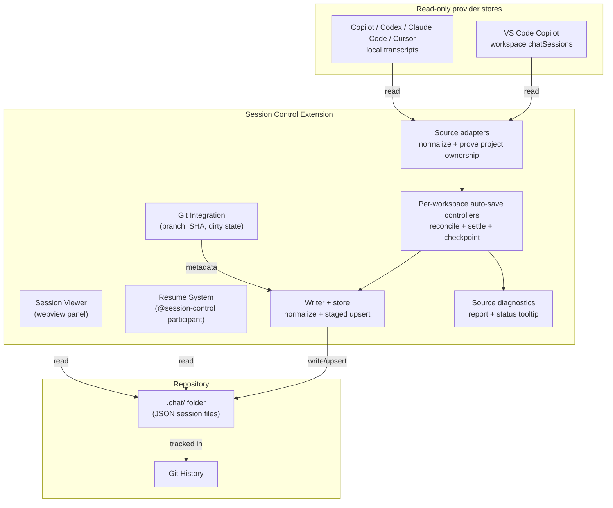

# Architecture

Session Control is structured around save, resume/analysis, and viewing subsystems connected by a shared saved-session store. Manual import and project-scoped auto-save share provider readers, normalization, bloat controls, and persistence while keeping different selection and ownership rules.

## System Diagram

```mermaid
graph TB
    subgraph "Read-only provider stores"
        CopilotStorage["VS Code Copilot<br/>workspace chatSessions"]
        CliStores["Copilot / Codex / Claude Code / Cursor<br/>local transcripts"]
    end

    subgraph "Session Control Extension"
        Adapters["Source adapters<br/>normalize + prove project ownership"]
        Controllers["Per-workspace auto-save controllers<br/>reconcile + settle + checkpoint"]
        SaveSystem["Writer + store<br/>normalize + staged upsert"]
        ResumeSystem["Resume System<br/>(@session-control participant)"]
        SessionViewer["Session Viewer<br/>(webview panel)"]
        GitIntegration["Git Integration<br/>(branch, SHA, dirty state)"]
        Diagnostics["Source diagnostics<br/>report + status tooltip"]
    end

    subgraph "Repository"
        ChatFolder[".chat/ folder<br/>(JSON session files)"]
        GitRepo["Git History"]
    end

    CopilotStorage -->|read| Adapters
    CliStores -->|read| Adapters
    Adapters --> Controllers
    Controllers --> SaveSystem
    GitIntegration -->|metadata| SaveSystem
    Controllers --> Diagnostics
    SaveSystem -->|write/upsert| ChatFolder
    ChatFolder -->|tracked in| GitRepo
    ResumeSystem -->|read| ChatFolder
    SessionViewer -->|read| ChatFolder
```

## Subsystems

### Save System
Reads supported local provider stores, transforms them into the [Session Format](session-format.md), enriches with git metadata via [Git Integration](git-integration.md), and writes to the configured storage directory. Manual saves use explicit user selection. Auto-save requires positive workspace ownership and adds automatic origin metadata before an ownership-scoped upsert. Both paths apply bloat controls. See [Save System](save-system.md).

### Resume System
A registered VS Code chat participant (`@session-control`) that reads saved sessions from `.chat/`, applies context limits (max turns, max chars), and injects prior conversation as LLM context. See [Resume System](resume-system.md) and [Chat Participant](chat-participant.md).

### Session Store
CRUD layer for saved session files in `.chat/`. Handles file naming, searching, fuzzy matching, archival, and deletion. Used by both Save and Resume systems.

### Session Viewer
An HTML webview panel (`SessionViewerPanel`) that renders saved sessions as a formatted conversation view. Accessible from the Session Explorer sidebar (click a session) or from the editor title bar when a recognized session JSON file is open. Tracks session metadata (title, filename) and exposes it via public getters. Uses `buildPageHtml()` to generate a self-contained HTML page with CSP nonce, markdown rendering via `marked`, and XSS-safe escaping. When the viewer is active, a resume icon (▶ debug-start) appears in the editor title bar; clicking it opens the chat panel with a pre-filled `@session-control /resume` command. See `src/sessionViewer.ts`.

### Git Integration
Wraps the VS Code Git extension API and provides branch name, commit SHA, and dirty state for saved-session metadata. Chat-response auto-save does not depend on commit events. See [Git Integration](git-integration.md).

### Auto-Save on Chat Response
`autoSaveWorkspaceManager` maintains one controller per enabled folder. Configured source adapters reconcile at startup, on source create/change events, after relevant settings/folder changes, during missing-directory recovery, and on a fallback interval. Controllers settle streaming files, compare semantic revisions, persist/rebuild checkpoints, isolate source failures, and invoke the store's staged upsert. Diagnostics and the status tooltip remain per source/workspace. See [Save System](save-system.md#auto-save-on-chat-response) and [Configuration](configuration.md#auto-save-selection-and-migration).

## Data Flow

### Save Flow
1. User triggers `Session Control: Save Session...`
2. The provider picker selects the relevant provider reader
3. User selects which normalized session to save via QuickPick
4. `sessionWriter` transforms to [Session Format](session-format.md), applies bloat controls
5. `sessionStore` writes JSON to the configured storage directory with git metadata from `gitIntegration`

### Auto-Save Flow
1. Each enabled workspace controller resolves every source selected by `autoSave.providers`
2. A startup/event/maintenance reconciliation reads only positively matched candidates
3. The controller waits for stable semantic content and skips an unchanged revision
4. Writer attaches automatic source/session/revision ownership
5. Store publishes the new single/split set, then retires only the previous matching automatic set
6. Controller records the checkpoint/success and refreshes Session Explorer once

### View Flow
1. User opens a session JSON file in the editor (or clicks a session in Session Explorer)
2. Extension sets context key `session-control.isSessionFile` when the active file is a valid session
3. Editor title bar shows a preview icon button and (when viewer is open) a resume icon
4. User clicks the preview button (or runs `Session Control: View Session` from the command palette)
5. `extension.ts` parses the document, validates with `isChatSession()`, and calls `SessionViewerPanel.createOrShow()`
6. Webview panel renders the full conversation with metadata, summary, turns, tool calls, and git info
7. Once the viewer is open, the resume icon (▶) appears in the title bar; clicking it opens the chat panel with `@session-control /resume <session-title>` pre-filled

### Resume Flow
1. User types `@session-control /resume fix-auth-bug` in chat
2. `chatParticipant` handler receives the request
3. `sessionStore` searches `.chat/` for matching session (fuzzy match)
4. Session JSON loaded, reassembled if split across parts
5. Context limits applied per [Configuration](configuration.md) (maxTurns, maxContextChars, overflowStrategy)
6. Prior turns injected as context; summary streamed to user

## Storage Format

Sessions are stored as JSON files in `.chat/`:  
`{timestamp}-{slugified-title}.json`  
e.g., `2026-04-12T14-30-fix-auth-bug.json`

Split sessions append `-part1`, `-part2`, etc. with linking metadata.

See [Session Format](session-format.md) for the full schema.

## Technology Constraints

- **VS Code `^1.93.0`** — Required for stable chat participant API
- **TypeScript** — Extension language
- **Webpack** — Bundling
- **VS Code Git Extension API** — For git metadata (not shelling out to git CLI)
- **Local-store visibility** — Provider transcripts must be visible to the running extension host; cross-host/profile/container/WSL inference is intentionally unsupported
- **Provider format stability** — Local transcript formats are adapter-isolated and fixture-tested but are not stable cross-provider APIs
