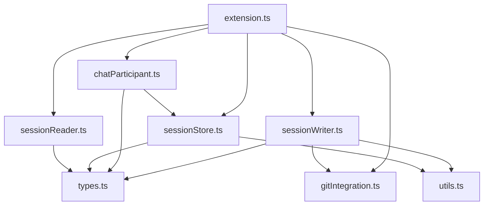

# File Manifest

Planned source files for the chat-commit extension, their roles, and dependencies.

## Source Files

| File | Role | Dependencies |
|------|------|-------------|
| `package.json` | Extension manifest: commands, settings, chat participant, menus | — |
| `src/extension.ts` | Entry point: registers commands and chat participant | All modules |
| `src/sessionReader.ts` | Reads Copilot internal session files; handles format versioning | VS Code internal API |
| `src/sessionWriter.ts` | Transforms raw sessions to [Session Format](session-format.md); writes to disk | `types.ts`, `gitIntegration.ts`, `utils.ts` |
| `src/chatParticipant.ts` | `@chat-commit` chat participant handler (resume logic) | `sessionStore.ts`, `types.ts` |
| `src/gitIntegration.ts` | Git extension API wrapper: branch, SHA, commit listener | `vscode.git` extension API |
| `src/sessionStore.ts` | CRUD operations on saved session files in `.chat/` | `types.ts`, `utils.ts` |
| `src/types.ts` | TypeScript interfaces: `ChatSession`, `SavedTurn`, etc. | — |
| `src/utils.ts` | Utilities: slugify, timestamp formatting, fuzzy matching | — |

### Open Source & CI Files

| File | Role |
|------|------|
| `LICENSE` | MIT license |
| `README.md` | Project overview, installation, usage, configuration, contributing |
| `CONTRIBUTING.md` | Dev setup, testing, PR guidelines |
| `CODE_OF_CONDUCT.md` | Contributor Covenant v2.1 |
| `CHANGELOG.md` | Release history (Keep a Changelog format) |
| `.github/ISSUE_TEMPLATE/` | Bug report and feature request templates |
| `.github/PULL_REQUEST_TEMPLATE.md` | PR checklist |
| `.github/workflows/ci.yml` | CI pipeline: lint, build, test, Snyk scan |
| `.github/workflows/release.yml` | Publish to VS Code Marketplace + Open VSX on tag push |

## Dependency Graph

## Package.json Contributions

### Commands
- `chat-commit.saveSession` — "Chat Commit: Save Current Chat Session"
- `chat-commit.listSessions` — "Chat Commit: Browse Saved Sessions"
- `chat-commit.deleteSession` — "Chat Commit: Delete Saved Session"

### Chat Participant
- **ID**: `chat-commit.resume`
- **Name**: `chat-commit`
- **Description**: "Resume a saved chat session"
- **Commands**: `resume`, `list`

### Menus
- "Save Chat Session" in `chat/context` menu or command palette

### Tree View (Phase 4 stretch)
- `chat-commit.sessionExplorer` — Sidebar panel listing saved sessions
