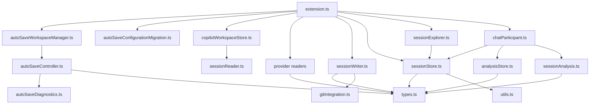

# File Manifest

Implemented source files for the session-control extension, their roles, and principal dependencies.

## Source Files

| File | Role | Dependencies |
|------|------|-------------|
| `package.json` | Extension manifest: commands, settings, chat participant, menus | — |
| `src/extension.ts` | Entry point: registers commands, chat participant, one auto-save controller per enabled workspace folder, source adapters, diagnostics, status, migration, and Session Explorer refresh | All modules |
| `src/autoSaveWorkspaceManager.ts` | Reconciles enabled workspace folders with live controllers; rebuilds affected controllers when folder/resource configuration changes | `autoSaveController.ts` |
| `src/autoSaveController.ts` | Provider-independent watcher, debounce, settle/retry, semantic-revision, checkpoint, reconciliation, and per-source failure coordination | `autoSaveDiagnostics.ts`, `types.ts` |
| `src/autoSaveDiagnostics.ts` | Per-source diagnostic state, redacted copyable report, project-match descriptions, and health/status tooltip summaries | — |
| `src/autoSaveConfigurationMigration.ts` | One-time, scope-preserving migration from legacy explicit `save.provider` auto-save intent to `autoSave.providers` | `types.ts`, VS Code configuration/state |
| `src/copilotWorkspaceStore.ts` | Validates the active-profile VS Code Copilot workspace store and records single-root/profile/remote limitations | `sessionReader.ts`, `autoSaveDiagnostics.ts` |
| `src/copilotCliSessionReader.ts` | Discovers and normalizes project-owned Copilot CLI `session-state/*/events.jsonl` transcripts with semantic revisions | `types.ts` |
| `src/codexSessionReader.ts` | Normalizes Codex transcript files with stable revisions and supports strict workspace matching for auto-save | `types.ts` |
| `src/claudeCodeSessionReader.ts` | Normalizes project-scoped Claude Code JSONL, excluding sidechains/subagents, with stable revisions | `types.ts` |
| `src/cursorCliSessionReader.ts` | Defines the experimental workspace-derived Cursor CLI source contract | `cursorAgentTranscriptReader.ts`, `types.ts` |
| `src/cursorAgentTranscriptReader.ts` | Parses Cursor Agent transcript JSONL and derives project/transcript paths | `types.ts` |
| `src/cursorSessionReader.ts` | Combines Cursor CLI transcripts with separately validated legacy Cursor IDE `chatSessions` for manual import compatibility | `cursorCliSessionReader.ts`, `sessionReader.ts`, `types.ts` |
| `src/sessionReader.ts` | Reads VS Code Copilot `.json`/`.jsonl` workspace sessions with format/error classification | `types.ts` |
| `src/sessionWriter.ts` | Normalizes sessions, preserves optional auto-save `origin`, renders summaries, and applies bloat controls | `types.ts`, `gitIntegration.ts`, `utils.ts` |
| `src/sessionStore.ts` | CRUD plus temporary-file writes, origin lookup, staged automatic-snapshot upsert/rollback, pruning, and orphan-part inspection | `types.ts`, `utils.ts` |
| `src/types.ts` | Saved-session/provider types, backward-compatible automatic ownership metadata, analysis types, and runtime guards | — |
| `src/analysisStore.ts` | Persists analysis reports and fingerprint-based analyzed-session state under `.chat/analysis/` | `types.ts` |
| `src/sessionAnalysis.ts` | Pure helpers for analysis selection parsing, timeframe filtering, AI-control-file and AI-skill-scoped analysis and implementation prompt construction, including comparison against existing instruction and skill files so reports only surface gaps | `types.ts` |
| `src/chatParticipant.ts` | `@session-control` chat participant handler for resume, list, analyze, and lightweight implementation workflows | `sessionStore.ts`, `analysisStore.ts`, `sessionAnalysis.ts`, `types.ts` |
| `src/gitIntegration.ts` | Git extension API wrapper for branch, SHA, and dirty-state metadata | `vscode.git` extension API |
| `src/sessionViewer.ts` | HTML webview panel for viewing saved sessions as formatted conversations | `types.ts`, `marked` |
| `src/sessionExplorer.ts` | Tree data provider for the Session Explorer sidebar view | `sessionStore.ts` |
| `src/utils.ts` | Utilities: slugify, timestamp formatting, fuzzy matching | — |
| `media/session-viewer.css` | Stylesheet for the session viewer webview | — |

### Open Source & CI Files

| File | Role |
|------|------|
| `LICENSE` | MIT license |
| `README.md` | Project overview, installation, usage, configuration, contributing |
| `CONTRIBUTING.md` | Dev setup, testing, PR guidelines |
| `CODE_OF_CONDUCT.md` | Contributor Covenant v2.1 |
| `CHANGELOG.md` | Release history (Keep a Changelog format) |
| `.github/ISSUE_TEMPLATE/` | Bug report and feature request templates |
| `.github/PULL_REQUEST_TEMPLATE.md` | PR checklist |
| `.github/workflows/ci.yml` | CI pipeline: lint, build, test, Snyk scan |
| `.github/workflows/release.yml` | Publish to VS Code Marketplace + Open VSX on tag push |

## Dependency Graph

```mermaid
graph TD
    ext["extension.ts"] --> manager["autoSaveWorkspaceManager.ts"]
    manager --> controller["autoSaveController.ts"]
    controller --> diagnostics["autoSaveDiagnostics.ts"]
    controller --> types["types.ts"]
    ext --> migration["autoSaveConfigurationMigration.ts"]
    ext --> copilotStore["copilotWorkspaceStore.ts"]
    ext --> readers["provider readers"]
    copilotStore --> sessionReader["sessionReader.ts"]
    readers --> types
    ext --> writer["sessionWriter.ts"]
    ext --> store["sessionStore.ts"]
    writer --> types
    writer --> git["gitIntegration.ts"]
    store --> types
    store --> utils["utils.ts"]
    ext --> explorer["sessionExplorer.ts"]
    explorer --> store
    ext --> cp["chatParticipant.ts"]
    cp --> store
    cp --> aStore["analysisStore.ts"]
    cp --> aHelpers["sessionAnalysis.ts"]
    aStore --> types
    aHelpers --> types
```

## Package.json Contributions

### Commands
- `session-control.saveSessionFromProvider` — "Save Session..."
- `session-control.listSessions` — "Browse Saved Sessions"
- `session-control.deleteSession` — "Delete Saved Session"
- `session-control.refreshSessionExplorer` — "Refresh Session Explorer"
- `session-control.sortSessionExplorer` — "Sort Saved Sessions..."
- `session-control.openSessionFromExplorer` — "Open Saved Session" (Session Explorer inline action)
- `session-control.viewSessionFile` — "View Session" (editor title preview action)
- `session-control.resumeSessionFromViewer` — "Resume This Session in Chat" (editor title action)
- `session-control.analyzeSavedChats` — "Analyze Saved Chats"
- `session-control.implementLatestAnalysis` — "Implement Latest Analysis"
- `session-control.importCopilotSkillsToCursor` — "Import Copilot Guidance as Cursor Skills"
- `session-control.importCopilotSkillsToCodex` — "Import Copilot Guidance as Codex Skills"
- `session-control.importCopilotSkillsToClaudeCode` — "Import Copilot Guidance as Claude Code Skills"
- `session-control.deleteSessionFromExplorer` — "Delete Saved Session" (Session Explorer inline action)
- `session-control.toggleAutoSave` — "Toggle Auto-Save on Chat Response" (toggles `autoSaveOnChatResponse`)
- `session-control.diagnoseAutoSave` — "Diagnose Auto-Save" (copies a redacted per-workspace source report)
- `session-control.cleanupOrphanedParts` — "Clean Up Orphaned Session Part Files"

### Chat Participant
- **ID**: `session-control.resume`
- **Name**: `session-control`
- **Description**: "Resume a saved chat session"
- **Commands**: `resume`, `list`, `analyze`, `implement`

### Menus
- Command palette entries cover save, browse, analyze, implement, import, delete, auto-save toggle/diagnostics, and orphan cleanup actions.

### Tree View
- `session-control.sessionExplorer` — Sidebar panel listing saved sessions grouped by workspace

### Editor Title Menu
- `session-control.viewSessionFile` — Preview icon shown when the active file is a recognized session (`.json`/`.jsonl`) via context key `session-control.isSessionFile`
