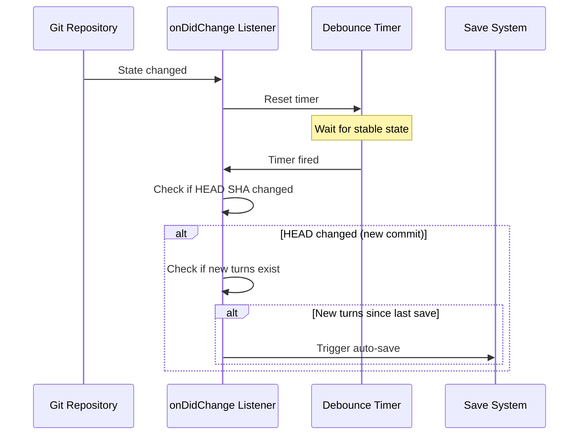

# Git Integration

Git integration provides commit metadata for saved sessions and optional auto-save triggers. Implemented in `src/gitIntegration.ts`.

## VS Code Git Extension API

Session Control uses the built-in VS Code Git extension API (not the git CLI):

```typescript
const gitExtension = vscode.extensions.getExtension('vscode.git')?.exports;
const git = gitExtension.getAPI(1);
const repo = git.repositories[0];
```

## Metadata Capture

On every save, the following git context is captured:

| Field | Source | Example |
|-------|--------|---------|
| `branch` | `repo.state.HEAD?.name` | `"feature/fix-auth"` |
| `commit` | `repo.state.HEAD?.commit` | `"a1b2c3d..."` |
| `dirty` | `repo.state.workingTreeChanges.length > 0` | `true` |

This metadata is embedded in the [Session Format](session-format.md) `git` object.

## Auto-Save on Commit

When `autoSaveOnCommit` is enabled ([Configuration](configuration.md)):

1. **Listener**: Watches `repo.state.onDidChange` for HEAD changes
2. **Debounce**: Avoids saving on every micro-state change (e.g., staging files)
3. **Change detection**: Only saves if there are new turns since the last save (tracked via turn count or content hash)
4. **Trigger**: When a new commit is detected (HEAD SHA changed), automatically saves the most recent active chat session



## Multi-Root Workspace Support

In multi-root workspaces, git metadata comes from the repository associated with the active file's workspace folder. Session files are saved to the `.chat/` folder of that workspace folder.
