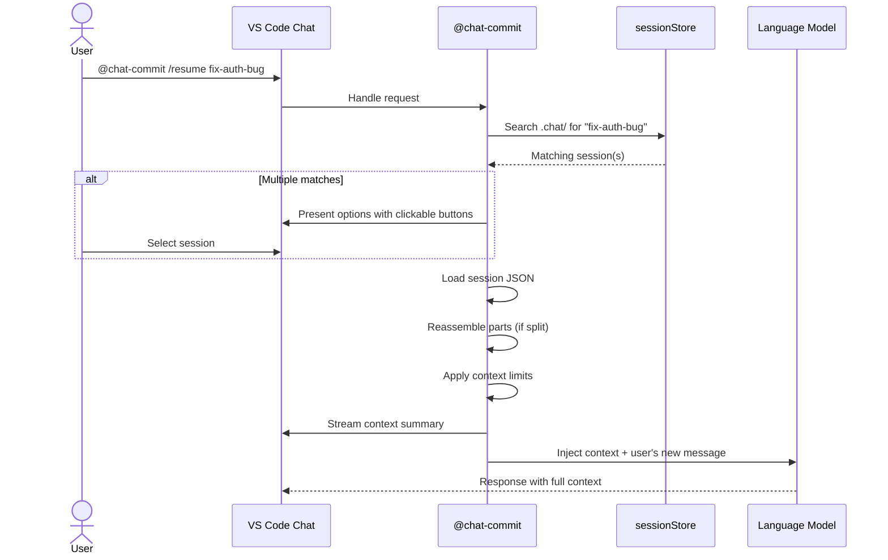

# Resume System

The Resume System enables users to load a previously saved chat session and continue the conversation with full context. It operates through the [Chat Participant](chat-participant.md) (`@chat-commit`).

## Core Mechanism

When a user resumes a session, the system:

1. **Finds** the saved session in `.chat/` (fuzzy match on title/filename)
2. **Loads** the JSON file (reassembles multi-part sessions if split)
3. **Applies limits** to fit within LLM context windows
4. **Injects** prior turns as a context preamble
5. **Streams** a summary to the user showing what was loaded

## Resume Flow

## Context Limits

Configured via [settings](configuration.md):

| Setting | Default | Effect |
|---------|---------|--------|
| `resume.maxTurns` | `50` | Max turns to inject |
| `resume.maxContextChars` | `80000` | Hard cap on total injected characters |
| `resume.overflowStrategy` | `summarize` | How to handle excess: `summarize`, `truncate`, `recent-only` |

### Overflow Strategies

**`summarize`** (default)  
Older turns beyond `maxTurns` are sent to the LLM with a "summarize this conversation so far" prompt. The summary becomes a preamble, followed by the most recent turns verbatim. Best quality but costs an extra LLM call.

**`truncate`**  
Silently drops oldest turns until within limits. Fast but loses early context without any summary.

**`recent-only`**  
Loads only the last N turns. Prepends a note: *"Earlier turns omitted (M total)"*. No summary, no extra LLM call. Simplest approach.

## Follow-Up Context

On subsequent turns in the same conversation (detected via `context.history`):
- The loaded session context is re-injected on each follow-up
- Context budget includes **both** the saved session turns **and** new turns in the current conversation
- `maxTurns` and `maxContextChars` limits are re-applied each time
- Uses `request.model.sendRequest()` or similar to prepend saved turns as prior context

This ensures the LLM "remembers" the saved conversation across the entire resumed session, not just the first message.

## Session Selection UX

- **With argument**: `@chat-commit /resume fix-auth-bug` — fuzzy match on title/filename
- **Multiple matches**: Options presented in chat response with clickable command buttons
- **No argument**: QuickPick of all saved sessions
- **Display metadata**: title, date, branch, commit SHA, turn count
- **List command**: `@chat-commit /list` shows all available sessions
