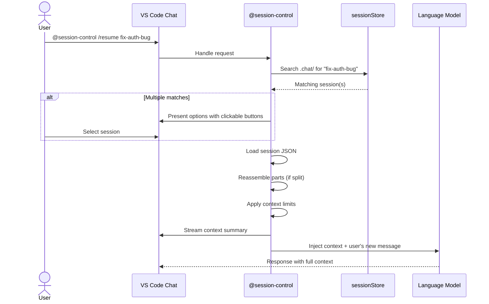

# Resume System

The Resume System enables users to load a previously saved chat session and continue the conversation with full context. It operates through the [Chat Participant](chat-participant.md) (`@session-control`).

## Core Mechanism

When a user resumes a session, the system:

1. **Finds** the saved session in `.chat/` (fuzzy match on title/filename)
2. **Loads** the JSON file (reassembles multi-part sessions if split)
3. **Applies limits** to fit within LLM context windows
4. **Injects** prior turns as a context preamble
5. **Streams** a summary to the user showing what was loaded

## Resume Flow

```mermaid
sequenceDiagram
    actor User
    participant Chat as VS Code Chat
    participant CP as @session-control
    participant Store as sessionStore
    participant LLM as Language Model

    User->>Chat: @session-control /resume fix-auth-bug
    Chat->>CP: Handle request
    CP->>Store: Search .chat/ for "fix-auth-bug"
    Store-->>CP: Matching session(s)
    alt Multiple matches
        CP->>Chat: Present options with clickable buttons
        User->>Chat: Select session
    end
    CP->>CP: Load session JSON
    CP->>CP: Reassemble parts (if split)
    CP->>CP: Apply context limits
    CP->>Chat: Stream context summary
    CP->>LLM: Inject context + user's new message
    LLM-->>Chat: Response with full context
```

## Context Limits

Configured via [settings](configuration.md):

| Setting | Default | Effect |
|---------|---------|--------|
| `resume.maxTurns` | `50` | Max turns to inject |
| `resume.maxContextChars` | `80000` | Hard cap on total injected characters |
| `resume.overflowStrategy` | `summarize` | How to handle excess: `summarize`, `truncate`, `recent-only` |

### Overflow Strategies

**`summarize`** (default)  
Older turns beyond `maxTurns` are sent to the LLM with a "summarize this conversation so far" prompt. The summary becomes a preamble, followed by the most recent turns verbatim. Best quality but costs an extra LLM call.

**`truncate`**  
Silently drops oldest turns until within limits. Fast but loses early context without any summary.

**`recent-only`**  
Loads only the last N turns. Prepends a note: *"Earlier turns omitted (M total)"*. No summary, no extra LLM call. Simplest approach.

## Follow-Up Context

On subsequent turns in the same conversation (detected via `context.history`):
- The loaded session context is re-injected on each follow-up
- Context budget includes **both** the saved session turns **and** new turns in the current conversation
- `maxTurns` and `maxContextChars` limits are re-applied each time
- Uses `request.model.sendRequest()` or similar to prepend saved turns as prior context

This ensures the LLM "remembers" the saved conversation across the entire resumed session, not just the first message.

## Origin-Agent Resume

When `resume.target` is `origin-agent` (the default), resuming a session saved from Codex, Claude Code, or Cursor opens that provider's own chat surface instead of VS Code chat. The flow (`runResumeIntoOriginAgent` in `src/chatParticipant.ts`):

1. Resolve an open command for the provider from built-in candidates (overridable per provider via `resume.providerCommands`)
2. Compose the resume prompt (same overflow limits as above) and copy it to the clipboard
3. Resolve a focus command (`FOCUS_COMMAND_CANDIDATES` in `src/resumeTarget.ts`) that pushes focus into the provider's chat input
4. Auto-paste the clipboard into the focused input (with provider-tuned settle/retry timing for cold sidebar opens)
5. If focus resolution or paste fails, fall back to a "paste (Ctrl+V) to continue" message — the prompt is already on the clipboard

Provider focus commands (verified against local installs):

| Provider | Focus commands | Notes |
|----------|----------------|-------|
| Codex | `chatgpt.sidebarSecondaryView.focus`, `chatgpt.sidebarView.focus`, view-container commands | Webview sidebar; paste routes through the webview |
| Claude Code | `claude-vscode.focus`, sidebar view focus commands | Extra mount delay before focus/paste on cold opens |
| Cursor | `composer.focusComposer`, `workbench.panel.aichat.view.focus` | Verified against Cursor 3.9.16. The open command prefers `composer.newAgentChat` so the resume prompt lands in a fresh agent chat tab rather than the currently open conversation/draft (`aichat.newchataction` is the fallback and reuses the open composer). The agent composer is host-provided (not an extension webview), so auto-paste relies on VS Code's generic DOM paste fallback; if a Cursor release blocks it, the flow degrades to the clipboard fallback message. Override command IDs with `resume.providerCommands` if a Cursor build renames them. |

Copilot sessions always resume through VS Code chat (`workbench.action.chat.open` supports passing the prompt directly, no clipboard involved).

## Session Selection UX

- **With argument**: `@session-control /resume fix-auth-bug` — fuzzy match on title/filename
- **Multiple matches**: Options presented in chat response with clickable command buttons
- **No argument**: QuickPick of all saved sessions
- **Display metadata**: title, date, branch, commit SHA, turn count
- **List command**: `@session-control /list` shows all available sessions
