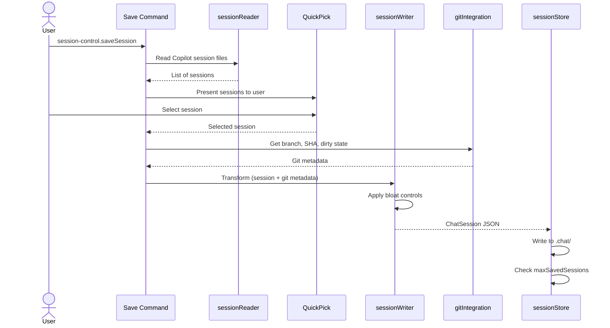

# Save System

The Save System is responsible for reading Copilot's internal chat sessions, transforming them into a structured format, and persisting them to the `.chat/` folder in the repository.

## Components

### Session Reader (`src/sessionReader.ts`)
- Accesses Copilot internal storage at:  
  `{context.globalStorageUri}/../../../workspaceStorage/{workspaceId}/chatSessions/`
- Alternatively derives from `context.storageUri` (gives `workspaceStorage/{workspaceId}/{extensionId}`) — go up one level + into `chatSessions/`
- Reads `.json` and `.jsonl` session files
- Parses session data: user prompts, assistant responses, tool invocations, file references
- Implements a **version-detection layer** to handle internal format changes gracefully

> ⚠️ Note: This relies on VS Code's internal Copilot storage format, which is undocumented and may change without notice. The version-detection layer is critical for graceful degradation.

### Session Writer (`src/sessionWriter.ts`)
- Transforms raw session data into the [Session Format](session-format.md)
- Enriches with git metadata from [Git Integration](git-integration.md) (branch, SHA, dirty state)
- Auto-generates title from first user prompt (truncated) or allows user rename
- Applies bloat controls before writing (see below)
- Generates embedded markdown summary for human-readable diffs

### Session Store (`src/sessionStore.ts`)
- Creates `.chat/` directory if it doesn't exist
- Writes files with naming convention: `{timestamp}-{slugified-title}.json`
- For split sessions: appends `-part1`, `-part2`, etc.
- Optionally creates parallel `.md` file for git diff browsing
- Enforces `maxSavedSessions` limit (archive or delete oldest)

## Workflow

## Bloat Controls

These controls prevent session files from growing too large. Configured via [settings](configuration.md):

| Setting | Default | Effect |
|---------|---------|--------|
| `save.maxFileSize` | `1mb` | Max size per session file |
| `save.overflowStrategy` | `split` | What to do when exceeded: `split`, `truncateOldest`, `warn` |
| `save.stripToolOutput` | `false` | Strip verbose tool outputs, keep names/summaries |
| `save.maxSavedSessions` | `0` (unlimited) | Max files in `.chat/` |
| `save.pruneAction` | `archive` | Move to `.chat/.archive/` or `delete` |

### Split Strategy
When a session exceeds `maxFileSize`, it's chunked into part files:
- `2026-04-12T14-30-fix-auth-bug-part1.json`
- `2026-04-12T14-30-fix-auth-bug-part2.json`
- Each part includes `part`, `totalParts`, `previousPartFile`, `nextPartFile` metadata for reassembly

### Strip Tool Output
When enabled, tool call output bodies are replaced with:  
`"[output stripped — N chars]"`  
Tool call names and summaries are preserved. Applied before the size check.

## Auto-Save on Chat Response

Optional feature controlled by the `session-control.autoSaveOnChatResponse` setting (default `false`). When enabled, the extension watches VS Code's internal Copilot chat session storage directory for file changes and automatically saves the session after each new response.

### How It Works
1. A file-system watcher monitors the Copilot `chatSessions/` directory for create and change events
2. Events are **debounced (5 seconds)** to batch rapid file writes from a single response
3. On trigger, the listener reads the most recently updated session file
4. It compares the current turn count against the last-saved turn count for that session ID
5. If the turn count increased, it performs an automatic save via `sessionWriter` and `sessionStore`
6. It tracks the previous auto-save file path per session ID and **deletes the old file** when a new version is saved, preventing file accumulation
7. The listener is **disabled after errors** to avoid repeated failures

### Diagnostics
All lifecycle events are logged to the **Session Control** output channel with `[auto-save]` prefix:
- `Watching: <path>` — confirms the directory being watched
- `File change detected, debouncing 5 s…` — watcher fired
- `Read N session(s).` — how many Copilot sessions were parsed
- `No sessions found — nothing to save.` — format unrecognized or directory empty
- `Latest: "<title>" id=<id> turns=<n>` — session picked for save consideration
- `Skipped — turn count unchanged` — no new turns since last save
- `Skipped — no workspace folder is open.` — no folder active
- `Saving to <path>…` — save is executing
- `Saved "<title>" (<n> turns) after chat response.` — success

### Implementation Details
- Exported as `registerAutoSaveOnChatResponseListener` from `src/extension.ts`
- Uses an `AutoSaveOnChatResponseDeps` interface for dependency injection, making it fully testable without touching the file system or VS Code APIs
- 4 dedicated tests in `test/unit/extensionAutoSave.test.ts` cover the listener lifecycle, debounce behavior, old-file cleanup, and error disabling

### Status Bar Integration
The status bar item reflects the `autoSaveOnChatResponse` setting. The toggle command (`session-control.toggleAutoSave`) toggles `autoSaveOnChatResponse` for the current workspace folder.

> ⚠️ Note: This feature relies on the internal Copilot storage directory structure. If VS Code changes where or how chat sessions are stored, the file watcher path will need updating.
