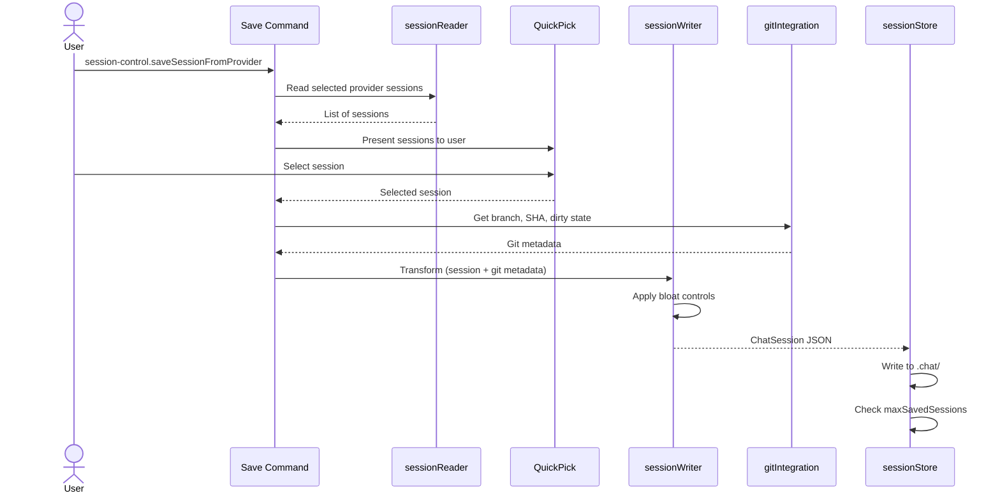

# Save System

The Save System reads supported Copilot, Codex, Claude Code, and Cursor transcript sources, transforms them into a shared structured format, and persists them to the workspace's configured storage folder (normally `.chat/`). Manual saves create independent snapshots; opt-in auto-save maintains one current automatic snapshot set per source session.

## Components

### Source Readers and Adapters

All readers normalize provider data into `SourceChatSession`. Auto-save wraps those sessions in candidates containing a stable source ID, source path, logical session ID, and semantic revision.

| Source ID | Reader / locator | Project ownership and limits |
|---|---|---|
| `copilot-vscode` | `src/sessionReader.ts` plus `src/copilotWorkspaceStore.ts`; reads `.json` and `.jsonl` from the active profile's validated `workspaceStorage/<workspace-id>/chatSessions` | Supported only for one local, file-backed workspace folder. Multi-root ownership is ambiguous, remote hosts are unsupported, and other VS Code profiles are not scanned. |
| `copilot-cli` | `src/copilotCliSessionReader.ts`; reads `session-state/<session-id>/events.jsonl` below `copilot.homePath`, `COPILOT_HOME`, or `~/.copilot` | Requires an absolute event-log working directory that overlaps the workspace. It does not read or modify `session-store.db`, provider hooks, settings, or retention state. |
| `codex-cli` | `src/codexSessionReader.ts`; scans `sessions/**/*.{json,jsonl}` below `codex.homePath`, `CODEX_HOME`, or `~/.codex` | Auto-save requires a positive canonical `cwd` match. Ambiguous global sessions remain available to interactive manual import but are rejected unattended. |
| `claude-code-cli` | `src/claudeCodeSessionReader.ts`; reads the workspace-encoded project directory below `claudeCode.homePath`, `CLAUDE_CONFIG_DIR`, or `~/.claude` | The project directory and, when present, canonical `cwd` must match. Subagent files and sidechain records are excluded. |
| `cursor-cli` | `src/cursorCliSessionReader.ts` plus `src/cursorAgentTranscriptReader.ts`; reads `agent-transcripts/**/*.jsonl` below the workspace-derived Cursor project directory | Experimental, fixture-backed contract. `cursor.projectsPath` overrides the projects root. Cloud/background sessions and unrecognized or unreadable local layouts are skipped. |

`cursor-vscode-legacy` remains a separate compatibility reader in `src/cursorSessionReader.ts`. It validates Cursor's `workspace.json` before reading legacy `chatSessions`, but it is not one of the current auto-save watch targets and is not treated as Cursor CLI history.

### Error Handling in Session Reader

The reader distinguishes three error classes when parsing session files:

| Error class | Meaning | Behaviour |
|---|---|---|
| `SyntaxError` | Corrupt / unparseable file | Log warning, skip file |
| `EmptySessionError` | Recognized snapshot-patch format (`kind:0`) but no completed turns yet | Log warning, skip silently — **no error popup** |
| `UnknownFormatError` | Unrecognized file shape | Log warning, increment unknown-count; if *all* files fail, show error popup |

The `EmptySessionError` case addresses sessions created by VS Code at the moment a user starts typing their first prompt, before any response has been written. These files contain a valid `kind:0` snapshot record with an empty `requests` array and must not be mistaken for a format VS Code no longer supports.

### Session Writer (`src/sessionWriter.ts`)
- Transforms raw session data into the [Session Format](session-format.md)
- Enriches with git metadata from [Git Integration](git-integration.md) (branch, SHA, dirty state)
- Auto-generates title from first user prompt (truncated) or allows user rename
- Applies bloat controls before writing (see below)
- Generates embedded markdown summary for human-readable diffs

### Session Store (`src/sessionStore.ts`)
- Creates `.chat/` directory if it doesn't exist
- Writes files with naming convention: `{timestamp}-{slugified-title}.json`
- For split sessions: appends `-part1`, `-part2`, etc.
- Writes each file through a temporary file and rename
- Implements ownership-scoped auto-save lookup and upsert
- Enforces `maxSavedSessions` limit (archive or delete oldest)

## Workflow


```mermaid
sequenceDiagram
    actor User
    participant Cmd as Save Command
    participant Reader as sessionReader
    participant QP as QuickPick
    participant Writer as sessionWriter
    participant Git as gitIntegration
    participant Store as sessionStore

    User->>Cmd: session-control.saveSessionFromProvider
    Cmd->>Reader: Read selected provider sessions
    Reader-->>Cmd: List of sessions
    Cmd->>QP: Present sessions to user
    User->>QP: Select session
    QP-->>Cmd: Selected session
    Cmd->>Git: Get branch, SHA, dirty state
    Git-->>Cmd: Git metadata
    Cmd->>Writer: Transform (session + git metadata)
    Writer->>Writer: Apply bloat controls
    Writer-->>Store: ChatSession JSON
    Store->>Store: Write to .chat/
    Store->>Store: Check maxSavedSessions
```

## Bloat Controls

These controls prevent session files from growing too large. Configured via [settings](configuration.md):

| Setting | Default | Effect |
|---------|---------|--------|
| `save.maxFileSize` | `1mb` | Max size per session file |
| `save.overflowStrategy` | `split` | What to do when exceeded: `split`, `truncateOldest`, `warn` |
| `save.stripToolOutput` | `false` | Strip verbose tool outputs, keep names/summaries |
| `save.maxSavedSessions` | `0` (unlimited) | Max files in `.chat/` |
| `save.pruneAction` | `archive` | Move to `.chat/.archive/` or `delete` |

### Split Strategy
When a session exceeds `maxFileSize`, it's chunked into part files:
- `2026-04-12T14-30-fix-auth-bug-part1.json`
- `2026-04-12T14-30-fix-auth-bug-part2.json`
- Each part includes `part`, `totalParts`, `previousPartFile`, `nextPartFile` metadata for reassembly

### Strip Tool Output
When enabled, tool call output bodies are replaced with:  
`"[output stripped — N chars]"`  
Tool call names and summaries are preserved. Applied before the size check.

## Auto-Save on Chat Response

Auto-save is an opt-in, resource-scoped feature controlled by `session-control.autoSaveOnChatResponse` (default `false`). Each enabled workspace folder receives its own controller. `session-control.autoSave.providers` selects provider groups and defaults to `copilot`, `codex`, `claude-code`, and `cursor`; the Copilot group activates both `copilot-vscode` when supported and `copilot-cli`. The manual `save.provider` preference does not narrow auto-save.

### Controller and Reconciliation

`src/autoSaveWorkspaceManager.ts` creates, replaces, and disposes controllers as folders or relevant resource settings change. `src/autoSaveController.ts` then:

1. Reconciles immediately at activation or enablement.
2. Watches each available source for create/change events while preserving the changed path.
3. Debounces event bursts for 5 seconds and prefers the uniquely matching source session.
4. Confirms semantic content settles across bounded reads (up to four reads, normally 250 ms apart) and retries recognized incomplete JSON/JSONL after 250, 500, and 1,000 ms.
5. Hashes normalized content including title, prompts, responses, references, and retained tool-call data. Timestamp-only touches are ignored; same-turn content changes are saved.
6. Checks for a newly created source directory every 30 seconds and runs a five-minute fallback scan for missed watcher events.
7. Runs one trailing reconciliation when an event arrives during an in-flight scan/save.

One source failure pauses only that source, warns once per failure episode, and retries it every 60 seconds. Other sources and workspaces continue. Recovery clears only the affected source's error/retry state.

### Durable Upsert

Auto-saved `ChatSession` files carry backward-compatible `origin` metadata:

```json
{
  "saveKind": "auto",
  "sourceId": "codex-cli",
  "sourceSessionId": "provider-session-id",
  "sourceRevision": "semantic-revision"
}
```

The controller persists lightweight workspace checkpoints keyed by source and provider session. If checkpoint state is missing or stale, it rebuilds identity and revision state from self-identifying `.chat` files.

`sessionStore.upsertAutoSaveSessions` accepts only new parts with matching automatic ownership. It stages every new single/split part, publishes the complete new set, rolls back a partial publication failure, and only then retires prior files with the same automatic source/session identity. Manual snapshots—even those sharing the provider session ID—are never replacement candidates. The operation has set-level publish/rollback semantics, but multiple filesystem renames are not a single filesystem-wide atomic transaction.

After a successful non-empty upsert, normal pruning runs and the Session Explorer refreshes once. Skips and failures do not report a successful refresh.

### Diagnostics and Status

The `Session Control: Diagnose Auto-Save` command copies a metadata-only report and writes it to the **Session Control** output channel. Per workspace and source, it reports enablement, selected providers, storage/source paths, path existence, match strategy, watcher state, validation, last event/scan/candidate count, skip, success, retry, and error state. The copyable report omits prompt/response text, titles, detailed skip/error text, and filenames.

The status-bar tooltip summarizes healthy/attention source counts and the latest successful provider/time. Detailed source reasons remain in the output channel.

> ⚠️ Note: Provider transcript locations and formats are implementation details rather than stable cross-provider APIs. Session Control reads provider stores without modifying them, fails closed when project ownership is ambiguous, and can capture only complete local transcripts visible to its current extension host. Remote/UI-host splits, containers, WSL boundaries, other VS Code profiles, and cloud/background-only sessions can therefore leave a source unavailable.

## Privacy Considerations

Saved session JSON files are plain text and record the full conversation, including all agent tool call inputs and outputs. **This makes them unsuitable for public repositories without review**, as they commonly contain:

- **Local filesystem paths** (e.g. `C:\Users\yourname\...`) exposing OS username and machine layout
- **Workspace-internal details** captured by agentic tool calls: file contents, terminal output, search results

Auto-save remains off until explicitly enabled. The toggle's enable flow warns that prompts, paths, file content, and tool output may be sensitive, then lets the user add an in-workspace storage folder to `.gitignore` or leave it trackable. The `session-control.includeInGitignore` setting remains available, and users can also add `.chat/` (or their configured `storagePath`) manually.
